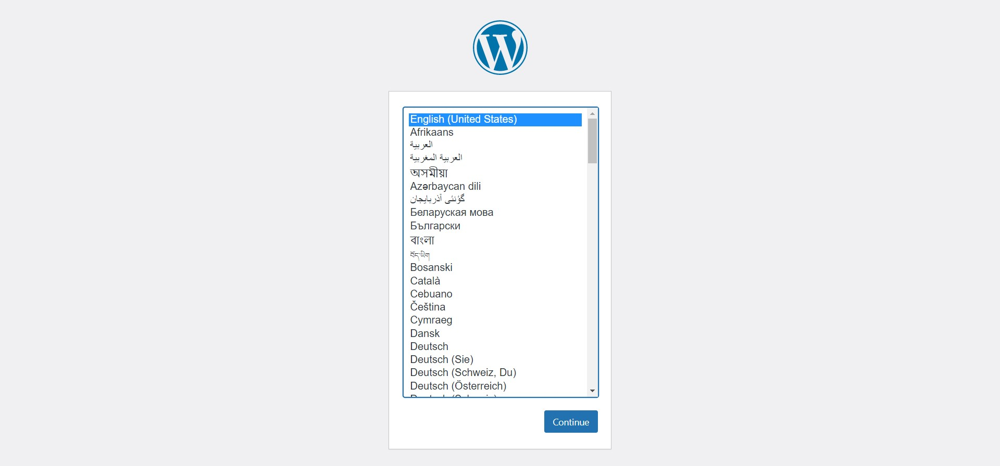

# Sign up for Wordpress

View the Wordpress at localhost:8080:
https://[[HOST_SUBDOMAIN]]-8080-[[KATACODA_HOST]].environments.katacoda.com

Choose the language and continue

Fill in the information and install WordPress

Log In after installing WordPress

Click Plugins and choose Add New

Search WooCommerce and click "Install Now" button

